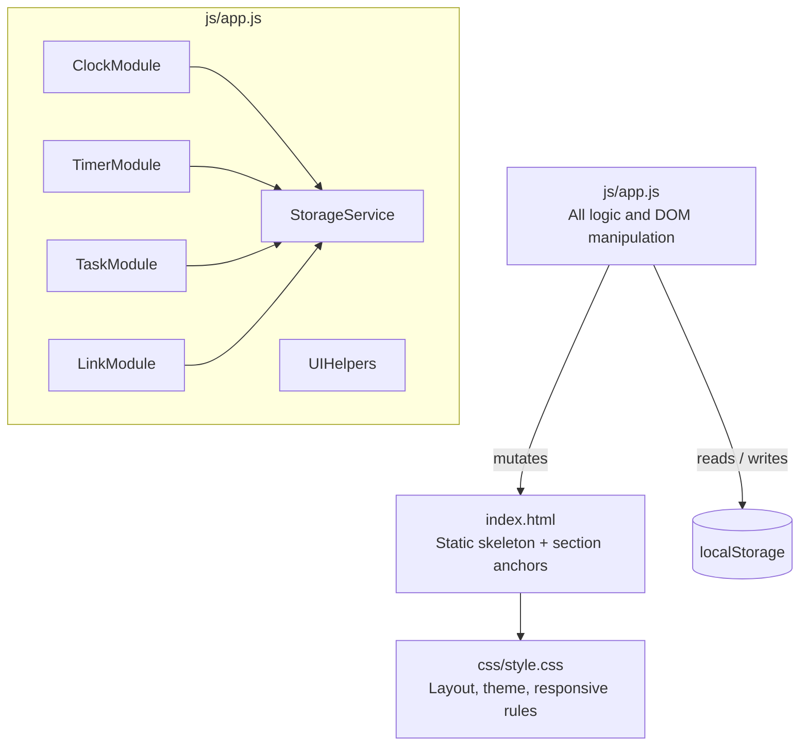
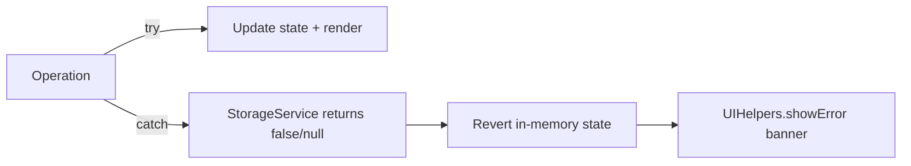

# Design Document — To-Do List Life Dashboard

## Overview

The To-Do List Life Dashboard is a self-contained, client-side web application delivered as three
plain files: `index.html`, `css/style.css`, and `js/app.js`. There is no build step, no server, and
no external runtime dependencies. All persistent state lives in the browser's `localStorage` API.

The application provides four main features on a single page:

1. **Clock & Greeting** — live time/date display with a time-sensitive salutation.
2. **Pomodoro Timer** — a configurable countdown with Start/Stop/Reset controls and end-of-session notifications.
3. **Task List** — full CRUD (create, read, update, delete) for to-do items, with completion toggling and persistent ordering.
4. **Quick Links** — a user-defined panel of shortcut buttons that open URLs in new tabs.

The entire UI is rendered by vanilla JavaScript against the HTML skeleton. No virtual DOM, no
reactive framework — state is kept in two in-memory arrays (`tasks[]` and `links[]`) that are
synchronised with `localStorage` on every mutating operation. The timer's countdown is driven by
`setInterval` / `clearInterval`. The clock is driven by a single recurring `setInterval` at 1 000 ms
cadence.

---

## Architecture

### High-Level Component Diagram



### Module Responsibilities

| Module | Responsibility |
|--------|---------------|
| `ClockModule` | Updates clock/date/greeting DOM nodes every second; handles visibility change events |
| `TimerModule` | Manages timer state machine (idle → running → paused → expired); fires notifications |
| `TaskModule` | CRUD operations on `tasks[]`; renders task list; delegates persistence to `StorageService` |
| `LinkModule` | CRUD operations on `links[]`; renders quick-links panel; delegates persistence to `StorageService` |
| `StorageService` | Thin wrapper around `localStorage`; serialises/deserialises JSON; exposes typed read/write/clear methods; surfaces errors |
| `UIHelpers` | Shared utilities: `showError()`, `showAlert()`, `confirmDialog()`, `sanitiseText()` |

### Data Flow

```
User interaction
      │
      ▼
DOM event listener (in module)
      │
      ▼
Validate input → reject early with UIHelpers.showError()
      │
      ▼
Mutate in-memory state (tasks[] or links[])
      │
      ├──▶ StorageService.write()  ──▶  localStorage
      │          │ on error
      │          └──▶ revert mutation + UIHelpers.showError()
      │
      └──▶ Re-render affected DOM section
```

---

## Components and Interfaces

### ClockModule

```js
ClockModule = {
  init(),          // Start 1 000 ms interval; attach visibilitychange listener
  tick(),          // Read Date(), update #clock-time, #clock-date, update greeting
  updateGreeting(hour: number), // Set greeting text per hour range
  handleVisibilityChange()     // Force tick() within one animation frame on tab focus
}
```

DOM targets: `#clock-time`, `#clock-date`, `#greeting`

### TimerModule

```js
TimerModule = {
  state: 'idle' | 'running' | 'paused' | 'expired',
  defaultDuration: number,   // seconds; default 1500
  remaining: number,         // seconds
  intervalId: number | null,

  init(),
  start(),
  stop(),
  reset(),
  tick(),                    // decrement remaining; check for expiry
  setDuration(seconds: number),
  notifyExpiry(),            // Notification API or on-screen alert fallback
  syncButtons()              // Enable/disable Start/Stop/Reset per state
}
```

DOM targets: `#timer-display`, `#btn-start`, `#btn-stop`, `#btn-reset`, `#timer-duration`, `#timer-error`

### TaskModule

```js
TaskModule = {
  tasks: Task[],   // in-memory list

  init(),          // Load from StorageService; render
  add(text: string),
  toggle(id: string),
  startEdit(id: string),
  saveEdit(id: string, text: string),
  cancelEdit(id: string),
  delete(id: string),
  render(),                // Full re-render of #task-list
  renderItem(task: Task),  // Returns a DOM element for one task
}
```

DOM targets: `#task-input`, `#btn-add-task`, `#task-list`, `#task-error`, `#task-empty`

### LinkModule

```js
LinkModule = {
  links: Link[],

  init(),
  add(label: string, url: string),
  delete(id: string),
  normaliseUrl(raw: string): string,  // Prepend https:// if needed
  open(url: string),
  render(),
  renderItem(link: Link),
}
```

DOM targets: `#link-label`, `#link-url`, `#btn-add-link`, `#quick-links`, `#link-error`, `#links-empty`

### StorageService

```js
StorageService = {
  KEYS: { TASKS: 'dashboard_tasks', LINKS: 'quickLinks' },

  readTasks(): Task[] | null,
  writeTasks(tasks: Task[]): boolean,
  readLinks(): Link[] | null,
  writeLinks(links: Link[]): boolean,
}
```

Each write/read wraps `localStorage` in a `try/catch` and returns `false` / `null` on failure
instead of throwing, allowing callers to branch on error.

---

## Data Models

### Task

```js
/**
 * @typedef {Object} Task
 * @property {string}  id        - UUID v4 generated at creation time (crypto.randomUUID())
 * @property {string}  text      - Task description; 1–500 characters (trimmed)
 * @property {boolean} completed - false = pending; true = completed
 * @property {number}  createdAt - Unix timestamp (ms) via Date.now() at creation time
 * @property {number}  updatedAt - Unix timestamp (ms); set to Date.now() on every mutation
 */
```

Example JSON value:

```json
{
  "id": "3fa85f64-5717-4562-b3fc-2c963f66afa6",
  "text": "Review pull request #42",
  "completed": false,
  "createdAt": 1723593600000,
  "updatedAt": 1723593600000
}
```

### Link

```js
/**
 * @typedef {Object} Link
 * @property {string} id        - UUID v4 generated at creation time
 * @property {string} label     - Display text; 1–50 characters
 * @property {string} url       - Full URL after scheme normalisation; 1–2048 characters
 * @property {number} createdAt - Unix timestamp (ms) at creation time
 */
```

Example JSON value:

```json
{
  "id": "9b1deb4d-3b7d-4bad-9bdd-2b0d7b3dcb6d",
  "label": "GitHub",
  "url": "https://github.com",
  "createdAt": 1723593600000
}
```

---

## localStorage Schema

| Key | Type | Description |
|-----|------|-------------|
| `dashboard_tasks` | JSON string → `Task[]` | Ordered array of Task objects; written on every task mutation |
| `quickLinks` | JSON string → `Link[]` | Ordered array of Link objects; written on every link mutation |

**Versioning strategy**: The schema is intentionally minimal (no version field) for this initial
delivery. If a future version introduces breaking schema changes, a `dashboard_schema_version` key
will be added and a migration function run at `init()` time before reading tasks or links.

**Corruption handling**: On read, `StorageService` wraps `JSON.parse` in a `try/catch`. If the
value exists but cannot be parsed as a valid array, the service:
1. Deletes the corrupted key (`localStorage.removeItem`).
2. Returns `null` to the caller.
3. The calling module initialises with an empty array and shows a user-facing error.

---

## UI Layout and Responsive Design Strategy

The page is divided into a main grid of four sections. CSS Grid manages the macro layout; Flexbox
manages intra-section alignment and control rows.

```
┌─────────────────────────────────────────────┐
│  #clock-section         #greeting-section   │
│  (time, date)           (greeting text)      │
├─────────────────────────────────────────────┤
│  #timer-section                             │
│  (display, controls, custom duration)       │
├──────────────────────┬──────────────────────┤
│  #task-section       │  #links-section      │
│  (input, list)       │  (input, buttons)    │
└──────────────────────┴──────────────────────┘
```

### Breakpoints

| Viewport | Layout |
|----------|--------|
| ≥ 768 px | Two-column grid: task section left, links section right |
| < 768 px | Single-column stack; all sections full width |
| 320–767 px | Minimum tested width; no horizontal overflow; font sizes scale down with `clamp()` |

### CSS Strategy

- **Grid**: `display: grid` on `#app` with `grid-template-areas` for named placement.
- **Flexbox**: Used inside each section for button rows, task items, and link items.
- **Spacing**: CSS custom properties (`--space-sm`, `--space-md`, `--space-lg`) ensure consistent
  gap values; minimum 8 px between adjacent sections, 16 px for section separators.
- **Typography**: `font-size: clamp(14px, 1.5vw, 18px)` on `body`; `line-height: 1.5`.
- **Contrast**: All colour combinations are validated against WCAG 2.1 Level AA (4.5:1 text,
  3:1 non-text). A dark neutral background with off-white text is the default theme.
- **Focus styles**: Visible `:focus-visible` outline on all interactive elements; ≥ 2 px width.

---

## State Management Approach

State is held in two module-scoped arrays:

```
tasks: Task[]   (TaskModule private)
links: Link[]   (LinkModule private)
```

and two timer scalars:

```
TimerModule.remaining: number
TimerModule.state: string
```

**Mutation pattern** (used for every write operation):

```
1. Clone or compute next state.
2. Attempt StorageService.write(nextState).
3. If write succeeds → update in-memory array → call render().
4. If write fails    → do NOT update in-memory array → call UIHelpers.showError().
```

This keeps the in-memory state and `localStorage` consistent: the UI never shows state that
wasn't successfully persisted (except for UI-only transient states like edit mode).

**No two-way data binding**: DOM is treated as a pure output. Every mutation triggers a targeted
`render()` call that rebuilds the relevant DOM subtree from the current in-memory array.

---

## Event Handling Patterns

### Event Delegation

Task list and quick-links panel use a single delegated listener on the container element rather
than attaching listeners to individual items. This avoids listener leaks when items are re-rendered.

```js
document.getElementById('task-list').addEventListener('click', (e) => {
  const item = e.target.closest('[data-task-id]');
  if (!item) return;
  const id = item.dataset.taskId;
  if (e.target.matches('.btn-toggle'))  TaskModule.toggle(id);
  if (e.target.matches('.btn-edit'))    TaskModule.startEdit(id);
  if (e.target.matches('.btn-delete'))  TaskModule.delete(id);
  if (e.target.matches('.btn-save'))    TaskModule.saveEdit(id, /* read inline input */);
  if (e.target.matches('.btn-cancel'))  TaskModule.cancelEdit(id);
});
```

### Keyboard Shortcuts

| Trigger | Action |
|---------|--------|
| Enter in `#task-input` | Add task |
| Enter in task inline edit field | Save edit |
| Escape in task inline edit field | Cancel edit |
| Enter in `#link-label` or `#link-url` | Add link |

### Visibility Change

```js
document.addEventListener('visibilitychange', () => {
  if (document.visibilityState === 'visible') {
    requestAnimationFrame(() => ClockModule.tick());
  }
});
```

---

## Error Handling

All user-visible errors follow a consistent pattern:

1. **Inline field errors** — shown adjacent to the relevant input field, cleared when the user
   next modifies the field. Used for: empty task text, text too long, empty link fields, URL too
   long, timer duration out of range.
2. **Operation errors** — shown in a dismissible banner (`#error-banner`) when a `localStorage`
   write or read fails. The banner disappears after 5 seconds or on user dismissal.
3. **Load errors** — shown on page load if `localStorage` read fails; rendered in place of the
   task list or links panel with an explanatory message.
4. **Browser notification denial** — if `Notification.permission !== 'granted'`, the timer uses an
   on-screen alert that stays visible for at least 5 seconds or until dismissed (Req 4.7).
5. **Unsupported browser** — if feature detection for a required API (`localStorage`, `Notification`,
   `crypto.randomUUID`) fails on load, a `#browser-warning` banner is shown listing the minimum
   supported versions.

### Error Flow Diagram



---

## Correctness Properties

*A property is a characteristic or behavior that should hold true across all valid executions of a
system — essentially, a formal statement about what the system should do. Properties serve as the
bridge between human-readable specifications and machine-verifiable correctness guarantees.*

### Property 1: Task addition grows the list by exactly one

*For any* task list of arbitrary size and any valid (non-empty, ≤ 500 character, non-whitespace-only)
task description, adding that description to the list shall result in the list length increasing by
exactly one, and the new task's text shall equal the trimmed input.

**Validates: Requirements 5.2**

---

### Property 2: Whitespace-only and empty inputs are rejected

*For any* string composed entirely of whitespace characters (including the empty string), attempting
to add it as a task description shall be rejected: the task list length shall remain unchanged.

**Validates: Requirements 5.3**

---

### Property 3: Task persistence round-trip

*For any* valid task list, serialising it to JSON and deserialising it back shall produce an
object-equivalent list with the same IDs, text values, completion states, and timestamps.

**Validates: Requirements 10.3**

---

### Property 4: Completion toggle is its own inverse

*For any* task, toggling its completion state twice in sequence shall leave the task in its original
completion state (idempotent inverse). Toggling once shall flip the state from `completed` to
`pending` or vice versa.

**Validates: Requirements 7.1, 7.2**

---

### Property 5: Task edit preserves identity and updates text

*For any* task and any valid (non-empty, ≤ 500 character) edited text, saving the edit shall
update the task's `text` field to the trimmed value while leaving the task's `id`, `completed`
state, and `createdAt` timestamp unchanged.

**Validates: Requirements 8.3**

---

### Property 6: Deleted task is absent from the list

*For any* task list containing at least one task, deleting a task by its ID shall result in a list
that no longer contains any task with that ID, and all other tasks remain present and unchanged.

**Validates: Requirements 9.2**

---

### Property 7: Greeting is total and correct over 24-hour input space

*For any* integer hour value in `[0, 23]`, the greeting function shall return exactly one of
`"Good morning"` (05–11), `"Good afternoon"` (12–17), or `"Good evening"` (18–23 and 0–4), with no
input producing an empty string or an undefined value.

**Validates: Requirements 2.1, 2.2, 2.3**

---

### Property 8: URL scheme normalisation is idempotent

*For any* URL string that already begins with `"http://"` or `"https://"`, applying scheme
normalisation shall return the string unchanged. *For any* URL string that does not begin with a
recognised scheme, normalisation shall prepend `"https://"` exactly once — applying normalisation
a second time shall produce the same result.

**Validates: Requirements 11.6**

---

### Property 9: Link addition round-trip

*For any* valid link collection and a valid (label 1–50 chars, URL 1–2048 chars after normalisation)
link, adding the link and then reading the collection back from its serialised form shall contain a
link with the same label and normalised URL.

**Validates: Requirements 11.2, 14.4, 14.5**

---

### Property 10: Timer display format is always MM:SS

*For any* remaining-seconds value in `[0, 3600]`, the timer display function shall return a string
matching the pattern `MM:SS` where MM and SS are zero-padded two-digit integers and `SS` is in
`[00, 59]`.

**Validates: Requirements 3.2**

---

### Property 11: Timer duration validation rejects out-of-range values

*For any* integer duration outside `[60, 3600]` seconds, the `setDuration` function shall reject
it and leave the current default duration unchanged. *For any* duration inside `[60, 3600]` seconds,
it shall be accepted and set as the new default.

**Validates: Requirements 3.4, 3.5**

---

### Property 12: Task load ordering preserves creation timestamp order

*For any* persisted task list (regardless of the order operations were performed), loading the list
from `localStorage` shall render tasks sorted in ascending order of `createdAt` timestamp — the
earliest-created task appears first.

**Validates: Requirements 6.1, 10.1**

---

## Testing Strategy

### Dual Testing Approach

The project uses two complementary testing layers:

1. **Unit tests** — verify specific examples, edge cases, and error conditions.
2. **Property-based tests** — verify the universal properties defined above across many generated
   inputs, catching edge cases that example-based tests miss.

Both layers target the pure logic functions in `js/app.js`. DOM-dependent code is tested via
example-based integration tests using a headless browser (jsdom or Playwright).

### Property-Based Testing Library

**[fast-check](https://github.com/dubzzz/fast-check)** (MIT licence, actively maintained) is the
chosen PBT library. It runs in any JavaScript environment including Node.js and browser-based test
runners, requires no build tooling for basic usage, and generates shrinkable counterexamples.

Each property test is configured to run a minimum of **100 iterations**.

Tag format: `// Feature: todo-life-dashboard, Property {N}: {property_text}`

### Property Test Targets

| Property | Function Under Test | Generator Hints |
|----------|--------------------|--------------------|
| P1 – Task addition grows list | `TaskModule.add()` | `fc.array(taskArb)`, `fc.string({ minLength: 1, maxLength: 500 })` |
| P2 – Whitespace rejection | `TaskModule.add()` | `fc.stringOf(fc.constantFrom(' ', '\t', '\n'))` |
| P3 – Task persistence round-trip | `StorageService` JSON cycle | `fc.array(taskArb)` |
| P4 – Toggle is self-inverse | `TaskModule.toggle()` | `fc.record({ id: fc.uuid(), completed: fc.boolean(), ... })` |
| P5 – Edit preserves identity | `TaskModule.saveEdit()` | `fc.uuid()`, `fc.string({ minLength: 1, maxLength: 500 })` |
| P6 – Delete removes target | `TaskModule.delete()` | `fc.array(taskArb, { minLength: 1 })`, `fc.nat()` (index) |
| P7 – Greeting totality | `ClockModule.updateGreeting()` | `fc.integer({ min: 0, max: 23 })` |
| P8 – URL normalisation idempotent | `LinkModule.normaliseUrl()` | `fc.webUrl()`, `fc.string()` |
| P9 – Link persistence round-trip | `StorageService` JSON cycle | `fc.array(linkArb)` |
| P10 – Timer display format | `TimerModule.formatSeconds()` | `fc.integer({ min: 0, max: 3600 })` |
| P11 – Duration validation | `TimerModule.setDuration()` | `fc.integer({ min: -1000, max: 5000 })` |
| P12 – Load ordering | `TaskModule.init()` sorting | `fc.array(taskArb)` shuffled |

### Unit Test Targets

- **Clock**: Correct `toLocaleTimeString` / `toLocaleDateString` output for known locale strings;
  UTC fallback path when `Intl` throws.
- **Timer state machine**: All valid transitions (idle → running, running → paused, paused →
  running, any → reset, running → expired).
- **Task error paths**: LocalStorage write failure causes revert; corruption triggers empty-init
  with error message.
- **Link error paths**: Empty label, empty URL, label > 50 chars, URL > 2048 chars each show the
  correct field-level error.
- **Confirmation dialog**: Cancel keeps task/link intact; confirm removes it.

### Integration / End-to-End Tests

Use **Playwright** (or equivalent) to verify:
- Page loads in all four target browsers without console errors.
- Adding a task, reloading the page, and confirming the task is still displayed.
- Timer countdown reaches 00:00 and triggers the on-screen alert (notification permission denied).
- Quick link button opens a new tab with the correct URL.
- Responsive layout at 320 px, 768 px, and 1440 px widths produces no horizontal scroll.
